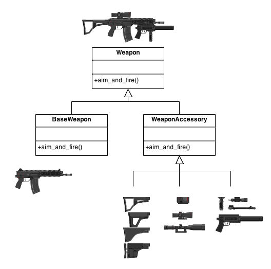

Decorator Patten 이란?
=====================
- 객체의 결합 을 통해 기능을 동적으로 유연하게 확장 할 수 있게 해주는 패턴.
     

# 의도와 동기
- 상속 보다 유연한 구현 방식
- 지속적인 기능의 추가와 제거가 용이함
- 데코레이터는 다른 데코레이터나 또는 컴포넌트를 포함해야 함
     

# Class diagram
* 클래스 다이어그램 보다는 이 그림이 뭔가 더 와 닿아서 이걸 가져왔다.

   

  