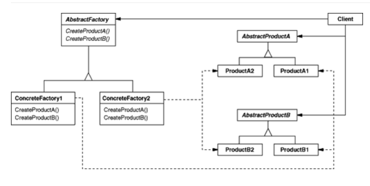

Abstract Factory Patten 이란?
=====================
- 여러 제품군을 한꺼번에 생성하는 패턴
     

# 의도와 동기
- 구체적인 클래스를 생성하지 않고도 관련성이 있거나 독립적인 여러 객체의 군을 생서앟기 위한 인터페이스를 제공한다.
- 추상화된 인터페이스 팩토리를 제공하고 상황에 따라 그에 맞는 인스턴스들이 생성되도록 함. 예를들어, 데이터베이스에 따라 DAO클래스가 달라져야
한다면, 현재 사용해야 하는 DB의 종류에 따른 DAO 인스턴스를 한꺼번에 생성하도록 한다.
- 생성되고 구성되고 표현되는 방식과 무관하게 시스템을 독립적으로 만들고자 할 때.
- 하나 이상의 제품군들 중 하나를 선택하여 시스템을 설정해야 하고 한 번 구성한 제품을 다른 것으로
대체할 수 있을 떄
     

# Class diagram

   

# 객체 협력
- AbstractFactory 
  개념적 제품에 대한 객체를 생성하는 오퍼레이션 인터페이스를 정의한다.
- ConcreteFactory 
  구체적인 제품에 대한 객체를 생성하는 오퍼레이션을 구현한다.
- AbstractProduct 
  개념적 제품 객체에 대한 인터페이스를 정의한다.
- ConcreteProduct 
  구체적으로 팩토리가 생성할 객체를 정의하고, AbstractProduct가 정의하고 있는 인터페이스를 구현한다.
- Client 
  AbstractFactory 와 AbstractProduct 클래스에 선언된 인터페이스를 사용한다.
     

# 결론
- 일반적으로 ConcreteFactory 클래스의 인스턴스는 실행 할 때 만들어진다.
- 구체적 팩토리는 어떤 특정 구현을 갖는 제품 객체를 생성한다. 서로 다른 제품 객체를 생성하기 위해서 사용자는 서로 다른
  ConcreteFactory를 사용한다.
- AbstractFactory 는 ConcreteFactory 서브클래스를 통해 필요한 제품 객체를 생성하는 책임을 위임한다.