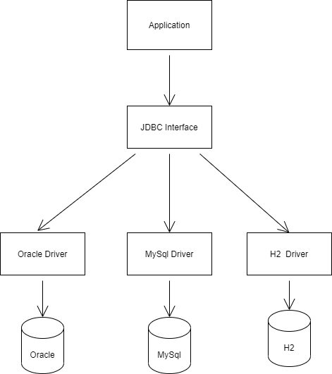

SOLID
=====================

# 좋은 객체지향 구조

**결합도**
- 모듈(클래스)간의 상호 의존 정도를 나타내는 지표로써 결합도가 낮으면 모듈간의 상호 의존성이 줄어들어서 객체의 재사용 및 유지보수가 유리하다.

**응집도**
- 하나의 모듈 내부에 존재하는 구성 요소들의 기능적 관련성으로 응집도가 높은 모듈은 하나의 책임에 집중하고 독립성이 높아져, 재사용 및 유지보수가 용이하다.
     

# 의도와 동기
- 클래스에서 만들 수 있는 인스턴스가 오직 하나이고 이에 대한 접근을 어디에서든지 하나로만 통일하여 제공.
- 어떤 클래스 경우에는 정확히 하나의 인스턴스만을 갖도록 하는 것이 중요하다. 예를들어, DB와 연결하는 connection은 여러개일 수 있지만, connection poll은 한 개이다.
- 자바에는 전역 변수가 존재하지 않으므로 인스턴스가 하남나 존재하도록 설계해야 하고 이에 접근 하는 방법을 제공.
     

# SRP(Single Responsibility Principle) 단일 책임 원칙
- 어떠한 클래스를 변경해야 하는 이유는 한 가지 뿐이여야 한다.

예를들어보자.

사람은 다음과 같은 행동을 한다. 이 클래스는 지금 많은 역할을 하고있다.
많은 역할을 수행한다는 것은 많은 책임을 가진다는 것이다. 또 다르게 표현하면 포괄적이다 라고 할 수 있을 듯하다.

- 잔다. 
- 먹는다. 
- 게임을 한다. 
- 노래를 부른다 
- 코딩을 한다. 
- 적을 공격한다. 

만약에 이 사람을 스타의 마린이라고 가정해보자. 사람이니까 이러한 행동을 하는게 맞다고 할 수 없다.
다시 말해서, 잔다. 먹는다. 게임을 한다. 등의 행위는 본래 취지에 맞지 않은 과한 책임을 가지고 있는것이다.
이 사람은 군인으로써 적을 공격한다. 의 수행만 할 수 있으면 되는 것이다.

* 물론 상황에 따라서 정말로 해당 클래스가 사람의 행동을 하는게 맞다면 위의 가정도 맞을 수 있다.

결론적으로는 상황에 맞게 해당 클래스가 본연의 만들어진 목적에 맞게 동작하는 것이 핵심이라고 보여진다.

   

# OCP(Open Closed Principle) 개방 폐쇄 

- 자신의 확정에는 열려 있고, 주변의 변화에 대해서는 닫혀 있어야 한다.
  상위 클래스 또는 인터페이스를 중간에 둠으로써, 자신은 변화에 대해서는 폐쇄적이지만, 인터페이스는 외부의
  변화에 대해서 확장을 개방해 줄 수 있다.
  이러한 부분은 JDBC와 Mybatis, Hibernate등 JAVA에서는 Stream에서 찾아볼 수 있다.

  
이 원칙에서 핵심은 코드를 수정하기 보다는 코드를 추가하여 기능을 수행하게 하는 것이라고 보여진다.
다음의 예는 어플리케이션 하위에 JDBC Interface를 두고있고 그 하위에 Oracle, Mysql, H2가 해당 인터페이스를 구현하면서 제기능을 발휘하는
형태이다.

그러면 반대로 만약에 JDBC인터페이스를 두지 않았다고 반대로 생각해보자.
어플리케이션 하위에 ORacleDriver만 존재하는 것이다. 그리고 프로젝트의 요구사항이 변경되어 MYSQL을 사용해야하는 상황이다.
그러면 우리는 기존에 있던 Oracle을 바꾸고 Mysql로 변경해야 할 것이다. 그렇게 겨우 변경을 했다. 근데 또 이번에는 H2를 사용한다고 한다.
그러면 또 바꿀 것인가..?

그러면 반대로 다시 돌아와서 JDBC Interface를 두고 하위에서 구현하는 형태라고 가정해보자.
이제 우리는 그 때 그 때, 필요한 코드를 추가하여 (Interface만 구현해주면 되니까..) 문제를 해결할 수 있다.
즉, 기존 코드는 건드리지 않은 채로 확장을 통해서 새로운 해동을 간단하게 추가할 수 있도록 하는 것.

# LSP(Liskov Substitution Principle) 리스코프 치환 원칙
- 서브 타입은 언제나 자신의 기반(상위) 타입으로 교체할 수 있어야 한다. 즉, 하위 클래스가 상위 클래스를 대신할 수 있다.

예를들어 포유류라는 상위 클래스가 존재하고 
-먹다. 
  라는 동작이 있다면 아래 하위 클래스인 고양이 강아지가 먹다를 수행할 수 있어야 한다는 것이다.
  기능적으로도 먹다를 수행할 수 있어야한다.

# ISP(Interface Segregation Principle) 인터페이스 분리 원칙
- 클라이언트는 자신이 사용하지 않는 메서드에 의존 관계를 맺으면 안된다.
  프로젝트 요구 사항과 설계에 따라서 SRP / ISP를 선택한다.

- 여러개의 인터페이스 상속으로 해결할 수 있는 원칙.
  예를들어, 사람과 돌고래가 있다. 이것을 연결하기 위해 Interface Animal을 만들었다. 
-먹다. 
-수영한다. 
-주먹을 쥔다. 

그리고 하위에서 이를 구현했다.
class Human impl Animal
-먹다 
-수영한다. 
-주먹을 쥔다. 

이번에는 돌고래이다. 
class Dolphin imple Animal 
-먹다 
-수영하다. 
-주먹을 쥔다.(?) => 이것은 불가능하다. 그러면 이것을 해결해본다.

기존의 Animal에서 주먹을 쥐는 행위를 빼준다. 
-먹다 
-수영한다.

(주먹을 쥔다를 영어로 잘 못하겠어서 그냥 Fistable이라고 썼습니다. 그냥 그러려니 무시하시면 됩니다.) 
interface Fistable extends Animal (그리고 주먹을 쥐는 행위를 위한 다른 인터페이스를 두고 기존의 animal을 상속받는다.) 
-주먹을 쥔다. 

class Humal impl Fistable (상위에서 상속받아 놨기 때문에 이렇게 사용가능해진다.) 
-먹다 
-수영한다 
-주먹을 쥔다. 

class Dolphin impl Animal ( animal에는 이제 주먹을 쥐는 행동이 없다.) 
-먹다. 
-수영한다. 

* SRP와 ISP는 같은 원인에 대하여 다른 해결책을 제시한다고 한다. 
=> SRP는 많은 책임을 지면 그냥 다 쪼개서 해결하는 반면, ISP는 그대로 두고 상황에 맞게 추가하든지 필터링해서 사용한다.

# DIP( Dependency Inversion Principle) 의존 역전 원칙
-  자신보다 변하기 쉬운 것에 의존하지 말아야 한다.

다시말해서 추상화에 의존하도록 하고, 구체화에 의존하면 안된다는 얘기인데.. 
예를들어보자. 

운전자는 자동차를 운전한다. 

그리고 자동차에는 여러 종류가 존재한다. 

운전자 => 자동차 => 아우디,포르쉐,람보르기니  

이러한 상황에서 운전자는 자동차에 의존하여 운전만 할 수 있으면 된다. 여기서 운전자가
각각의 자동차의 종류에 의존해서는 안된다. 왜냐하면 만약에 자동차가 종류에 의존하게 된다면
그 자동차 종류 하나가 변경되면 다른 코드들에도 영향을 미치게된다.
